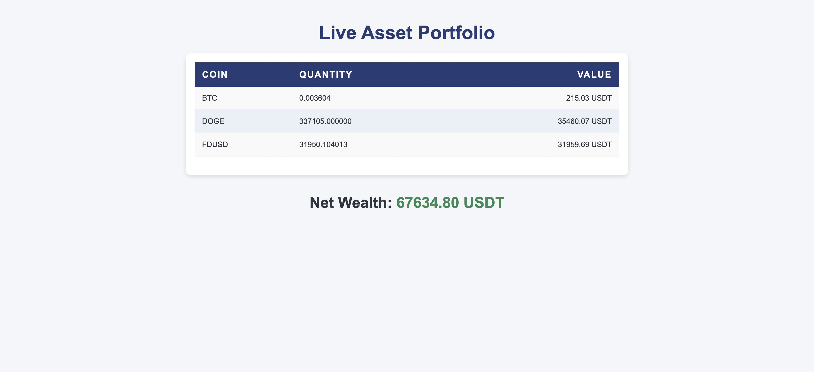

# Crypto Trading Realtime UI

This is a **backend project** built with **Fastify**, **Handlebars**, **WebSockets**, and the **Binance API**. The purpose of this UI is to check the balance of individual assets as well as the total asset value in both **test** and **production environments** for Binance users. It is designed as a companion tool for the **Binance Algo Trader** project to visualize real-time account balances and asset values.

## Table of Contents

- [Project Overview](#project-overview)
- [Features](#features)
- [Environment Setup](#environment-setup)
- [Installation](#installation)
- [Running the Application](#running-the-application)
- [API Documentation](#api-documentation)
- [WebSocket Integration](#websocket-integration)
- [Folder Structure](#folder-structure)
- [Adding UI Screenshots](#adding-ui-screenshots)
- [Contributing](#contributing)
- [License](#license)

## Project Overview

The **Crypto Trading Realtime UI** is a backend system to check real-time balances for both individual assets and the total value of all assets held in a Binance account. It connects to the **Binance API** to fetch and display this data using WebSockets for live updates. The UI is rendered using **Handlebars templates** for a responsive and elegant user interface.

This project supports:
- **Fastify** as the web framework for high performance.
- **WebSockets** to receive real-time updates.
- **Binance API** for fetching asset balances.
- **Handlebars** for rendering dynamic data.

## Features

- **Real-time balance updates** for individual assets and total value.
- **Test and Production environments** with dynamic switching via configuration.
- **WebSockets** for real-time communication and data updates.
- **Responsive UI** built using Handlebars templates (add UI screenshots below).
- **API Integration** with Binance to fetch balances.

## Environment Setup

The project uses a `.env` file for environment-specific configurations. You need to create this file to connect to the Binance API and set up WebSocket communication.

Here's a proper `.env` format example for your Binance API keys and settings:

### `.env` Example:
```env
# Binance API Credentials
BINANCE_API_KEY=BsqzqZH5xaWHuxaTFR7O5sQxXhrnyO26ThGgcdrTHWiK0m9upREB9JuiJZSqDE3K
BINANCE_API_SECRET=kYbAPQRNmOkDFTGgmkRKzkkM9RvGxJwPniI9EKGaKbWeBeoklSkuAtdLQq1xjG72

# API Base URL (Testnet or Production)
BASE_URL=https://testnet.binance.vision

# List of Coins (Comma-separated values)
COINS=AI,BTC,MANA,USDT
```

### Explanation:
- **BINANCE_API_KEY**: Your API key for authenticating with the Binance API.
- **BINANCE_API_SECRET**: Your secret key for signing API requests.
- **BASE_URL**: The base URL for Binance's API (Testnet or production). In this case, it's set to Binance's testnet URL.
- **COINS**: A list of cryptocurrencies you're interested in, specified as comma-separated values (e.g., `AI`, `BTC`, `MANA`, `USDT`).

This file should be placed at the root of your project, and you can use a library like `dotenv` in Node.js to load these variables into your application. Here's a simple example in Node.js:

### Node.js Example:
```javascript
require('dotenv').config();

const binanceApiKey = process.env.BINANCE_API_KEY;
const binanceApiSecret = process.env.BINANCE_API_SECRET;
const baseUrl = process.env.BASE_URL;
const coins = process.env.COINS.split(',');

console.log('API Key:', binanceApiKey);
console.log('API Secret:', binanceApiSecret);
console.log('Base URL:', baseUrl);
console.log('Coins:', coins);
```

This setup allows you to access your API credentials and coin list from environment variables safely without hardcoding them into your codebase.

## Installation

1. **Clone the repository**:
   ```bash
   git clone https://github.com/aviTak/Crypto-Trading-Realtime-UI.git
   cd Crypto-Trading-Realtime-UI
   ```

2. **Install dependencies**:
   ```bash
   npm install
   ```

3. **Set up the environment**:
   Create a `.env` file in the root directory with the details mentioned in the [Environment Setup](#environment-setup) section.

## Running the Application

To run the application, use the following command:

```bash
npm start
```

This will start the Fastify server on the default port `3000`. You can configure this port using environment variables in the `.env` file.

- **Test environment**: Data is fetched from Binance's test API.
- **Production environment**: Data is fetched from the live Binance API.

### Development Mode

For easier development and live reloading, you can run the app in development mode using:

```bash
npm run dev
```

This will enable live reloading, which is useful during development.

## API Documentation

This project exposes an API endpoint to fetch Binance account data:

### GET `/api/balance`

- Fetches the individual balances for all assets in the Binance account.
- Returns total balance in USDT equivalent.
- WebSockets will continuously update the balance if there are changes in real-time.

Example response:

```json
{
  "balances": {
    "BTC": { "asset": "BTC", "free": "0.001", "locked": "0" },
    "ETH": { "asset": "ETH", "free": "0.05", "locked": "0" },
    ...
  },
  "totalValueInUSDT": "2000.50"
}
```

## WebSocket Integration

This project uses **WebSockets** to establish a persistent connection between the client and server. It continuously fetches the latest balance data and updates the UI in real-time. The WebSocket connection is automatically established when the page is loaded, ensuring no lag between account changes and updates on the UI.

## Folder Structure

```bash
.
├── public/             # Static assets (CSS, JS, etc.)
├── views/              # Handlebars templates
├── routes/             # Fastify route definitions
├── services/           # Binance API service integration
├── websocket/          # WebSocket server setup
├── .env                # Environment variables
├── server.js           # Fastify server entry point
└── package.json        # Project dependencies
```

## UI Screenshots



## Contributing

If you'd like to contribute to this project, you can fork the repository, make changes, and submit a pull request.

### Fork Instructions

1. Click the **Fork** button in the top-right corner of the repository page.
2. Clone the forked repository:
   ```bash
   git clone https://github.com/YOUR_USERNAME/Crypto-Trading-Realtime-UI.git
   ```
3. Make your changes and push them to your fork:
   ```bash
   git add .
   git commit -m "Your detailed description of the changes."
   git push origin main
   ```
4. Open a pull request and describe your changes.

## License

This project is licensed under the MIT License. See the [LICENSE](LICENSE) file for details.
